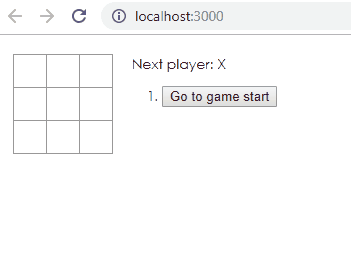

# Tic Tac Toe with React

## Prerequisites:

1. node.js

## Running locally

1. open a command prompt and navigate to the project directory
1. run `npm install` to install the node dependencies
1. run `npm start` which will launch the application in your browser (http://localhost:3000)

## Gameplay

